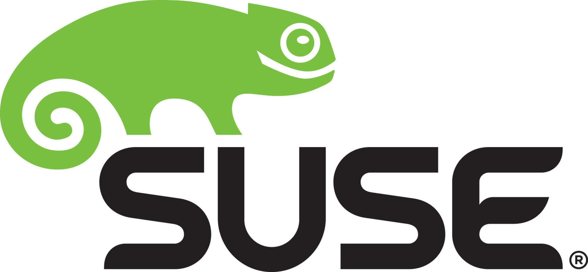

# Cloud Native Foundations

## Hi my name is Moises Sanabria. I am a passionate Machine Learning Engineer building Cloud Native End-to-End solutions. This repo documents my SUSE Cloud Native Foundations Udacity Scholarship using the Foam Note-taking Graph Editor

---

## Lessons

## Lesson 1

    
<a href="" style="font-size: 1.5em;">Introduction to Cloud Native</a>

    History of Cloud Native Architecture and intro to Cloud Native tools.

| LESSONS                                |                                             |
| -------------------------------------- | ------------------------------------------- |
| [1.1 — Meet Your Instructor]()         | [1.5 — CNCF and Cloud-Native Tooling]()     |
| [1.2 — Prequisites]()                  | [1.6 — Stakeholders]()                      |
| [1.3 — Course Outline]()               | [1.7 — Tools, Environment & Dependencies]() |
| [1.4 — Introduction to Cloud-Native]() | [1.8 — Recap]()                             |

---

## Lesson 2

    
<a href="" style="font-size: 1.5em;">Architecture Consideration for Cloud Native Applications</a>

    Monoliths and Microservices, their differences, and their pros and cons

### Notes in Repo

[Monoliths]()  
[Microservices]()  
[App Deployment]()

### Lessons Links to Udacity Course

| LESSONS                                                     |                                                            |
| ----------------------------------------------------------- | ---------------------------------------------------------- |
| [1. Introduction]()                                         | [8. Solution: Monoliths and Microservices]()               |
| [2. Design Considerations for Cloud-Native Applications]()  | [10. Quizzes: Best Practices For Application Deployment]() |
| [3.3 — Docker for Application Packaging]()                  | [11. Exercise: Endpoints for Application Status]()         |
| [3. Monoliths and Microservices]()                          | [12. Solution: Endpoints for Application Status]()         |
| [4. Quizzes: Monoliths and Microservices]()                 | [13. Exercise: Application Logging]()                      |
| [5. Trade-offs for Monoliths and Microservices]()           | [14. Solution: Application Logging]()                      |
| [6. Quizzes: Trade-offs for Monoliths and Microservices]()  | [15. Edge Case: Amorphous Applications]()                  |
| [7. Exercise: Trade-offs for Monoliths and Microservices]() | [16. Lesson Conclusion]()                                  |

---

## Lesson 3

    
<a href="" style="font-size: 1.5em;">Container Orchestration with Kubernetes</a>

    How to use Docker to create an image and how to deploy an application to Kubernetes

### Notes in Repo

[Docker]()  
[Kubernetes]()

### Lessons Links to Udacity Course

| LESSONS                                                                                                                                                                                                                                                                                                   |                                                                                                                                                                                                                                                                                                |
| --------------------------------------------------------------------------------------------------------------------------------------------------------------------------------------------------------------------------------------------------------------------------------------------------------- | ---------------------------------------------------------------------------------------------------------------------------------------------------------------------------------------------------------------------------------------------------------------------------------------------- |
| [3.1 — Introduction](https://classroom.udacity.com/nanodegrees/nd064-1/parts/30cb07da-8fd4-4438-a209-b3457adb5d82/modules/7b21dfa4-aac8-4d24-82c5-65325e6dc691/lessons/d9fa86b3-301d-4966-86f8-a2f34a5a7ca3/concepts/49f47d81-2aee-4dee-9384-11c45a53233a)                                                | [3.15 — Solution: Deploy Your First Kubernetes Cluster](https://classroom.udacity.com/nanodegrees/nd064-1/parts/30cb07da-8fd4-4438-a209-b3457adb5d82/modules/7b21dfa4-aac8-4d24-82c5-65325e6dc691/lessons/d9fa86b3-301d-4966-86f8-a2f34a5a7ca3/concepts/4afbeb16-941b-4baf-a472-c292d06621ea)  |
| [3.2 — Transitions from VMs to Containers](https://classroom.udacity.com/nanodegrees/nd064-1/parts/30cb07da-8fd4-4438-a209-b3457adb5d82/modules/7b21dfa4-aac8-4d24-82c5-65325e6dc691/lessons/d9fa86b3-301d-4966-86f8-a2f34a5a7ca3/concepts/63ed17c6-9707-44f9-a292-e8f23d9f0334)                          | [3.16 — Kubernetes Resources Part 1](https://classroom.udacity.com/nanodegrees/nd064-1/parts/30cb07da-8fd4-4438-a209-b3457adb5d82/modules/7b21dfa4-aac8-4d24-82c5-65325e6dc691/lessons/d9fa86b3-301d-4966-86f8-a2f34a5a7ca3/concepts/e87f8b41-188e-4943-87bd-9c2e84a2ecc0)                     |
| [3.3 — Docker for Application Packaging](https://classroom.udacity.com/nanodegrees/nd064-1/parts/30cb07da-8fd4-4438-a209-b3457adb5d82/modules/7b21dfa4-aac8-4d24-82c5-65325e6dc691/lessons/d9fa86b3-301d-4966-86f8-a2f34a5a7ca3/concepts/cd7dd70d-8cf9-4255-b54a-61a49e64ff08)                            | [3.17 — Kubernetes Resources Part 2](https://classroom.udacity.com/nanodegrees/nd064-1/parts/30cb07da-8fd4-4438-a209-b3457adb5d82/modules/7b21dfa4-aac8-4d24-82c5-65325e6dc691/lessons/d9fa86b3-301d-4966-86f8-a2f34a5a7ca3/concepts/13571c77-08c9-47e4-ada8-b0a78f712f1b)                     |
| [3.4 — Docker Walkthrough](https://classroom.udacity.com/nanodegrees/nd064-1/parts/30cb07da-8fd4-4438-a209-b3457adb5d82/modules/7b21dfa4-aac8-4d24-82c5-65325e6dc691/lessons/d9fa86b3-301d-4966-86f8-a2f34a5a7ca3/concepts/fe2f7043-2313-4773-8988-b9606012413d)                                          | [3.18 — Kubernetes Resources Part 3](https://classroom.udacity.com/nanodegrees/nd064-1/parts/30cb07da-8fd4-4438-a209-b3457adb5d82/modules/7b21dfa4-aac8-4d24-82c5-65325e6dc691/lessons/d9fa86b3-301d-4966-86f8-a2f34a5a7ca3/concepts/16ba756b-e410-4536-aecb-f710f79a2ea2)                     |
| [3.5 — Useful Docker Commands](https://classroom.udacity.com/nanodegrees/nd064-1/parts/30cb07da-8fd4-4438-a209-b3457adb5d82/modules/7b21dfa4-aac8-4d24-82c5-65325e6dc691/lessons/d9fa86b3-301d-4966-86f8-a2f34a5a7ca3/concepts/67dee0a1-d822-49d1-beef-fcdc77c6722f)                                      | [3.19 — Useful kubectl Commands](https://classroom.udacity.com/nanodegrees/nd064-1/parts/30cb07da-8fd4-4438-a209-b3457adb5d82/modules/7b21dfa4-aac8-4d24-82c5-65325e6dc691/lessons/d9fa86b3-301d-4966-86f8-a2f34a5a7ca3/concepts/9800e1a7-7350-4acc-9105-e5a06246d14a)                         |
| [3.6 — Quizzes: Docker for Application Packaging](https://classroom.udacity.com/nanodegrees/nd064-1/parts/30cb07da-8fd4-4438-a209-b3457adb5d82/modules/7b21dfa4-aac8-4d24-82c5-65325e6dc691/lessons/d9fa86b3-301d-4966-86f8-a2f34a5a7ca3/concepts/439eb8b3-f3fb-4eda-9246-10ce64aa49ab)                   | [3.20 — Quizzes: Kubernetes Resources](https://classroom.udacity.com/nanodegrees/nd064-1/parts/30cb07da-8fd4-4438-a209-b3457adb5d82/modules/7b21dfa4-aac8-4d24-82c5-65325e6dc691/lessons/d9fa86b3-301d-4966-86f8-a2f34a5a7ca3/concepts/952e8b1d-0881-4ceb-8515-34847a476be5)                   |
| [3.7 — Exercise: Docker for Application Packaging](https://classroom.udacity.com/nanodegrees/nd064-1/parts/30cb07da-8fd4-4438-a209-b3457adb5d82/modules/7b21dfa4-aac8-4d24-82c5-65325e6dc691/lessons/d9fa86b3-301d-4966-86f8-a2f34a5a7ca3/concepts/78ec0fc2-99c0-4abf-9310-85a2bb5dd42d)                  | [3.21 — Exercise: Kubernetes Resources](https://classroom.udacity.com/nanodegrees/nd064-1/parts/30cb07da-8fd4-4438-a209-b3457adb5d82/modules/7b21dfa4-aac8-4d24-82c5-65325e6dc691/lessons/d9fa86b3-301d-4966-86f8-a2f34a5a7ca3/concepts/0832ec55-f1ca-47aa-b839-27e521051096)                  |
| [3.8 — Solution: Docker for Application Packaging](https://classroom.udacity.com/nanodegrees/nd064-1/parts/30cb07da-8fd4-4438-a209-b3457adb5d82/modules/7b21dfa4-aac8-4d24-82c5-65325e6dc691/lessons/d9fa86b3-301d-4966-86f8-a2f34a5a7ca3/concepts/ff34636a-df61-4ad4-9aa7-f9c73a25d485)                  | [3.22 — Solution: Kubernetes Resources](https://classroom.udacity.com/nanodegrees/nd064-1/parts/30cb07da-8fd4-4438-a209-b3457adb5d82/modules/7b21dfa4-aac8-4d24-82c5-65325e6dc691/lessons/d9fa86b3-301d-4966-86f8-a2f34a5a7ca3/concepts/d772cf99-69c4-4b77-bf34-32532773a0e0)                  |
| [3.9 — Kubernetes - The Container Orchestrator Framework](https://classroom.udacity.com/nanodegrees/nd064-1/parts/30cb07da-8fd4-4438-a209-b3457adb5d82/modules/7b21dfa4-aac8-4d24-82c5-65325e6dc691/lessons/d9fa86b3-301d-4966-86f8-a2f34a5a7ca3/concepts/3512206c-0145-4952-a141-c0dc7e8fb0f8)           | [3.23 — Declarative Kubernetes Manifests](https://classroom.udacity.com/nanodegrees/nd064-1/parts/30cb07da-8fd4-4438-a209-b3457adb5d82/modules/7b21dfa4-aac8-4d24-82c5-65325e6dc691/lessons/d9fa86b3-301d-4966-86f8-a2f34a5a7ca3/concepts/526a25e3-cdf1-4e9f-8fc8-326f04dcf959)                |
| [3.10 — Quizzes: Kubernetes - The Container Orchestrator Framework](https://classroom.udacity.com/nanodegrees/nd064-1/parts/30cb07da-8fd4-4438-a209-b3457adb5d82/modules/7b21dfa4-aac8-4d24-82c5-65325e6dc691/lessons/d9fa86b3-301d-4966-86f8-a2f34a5a7ca3/concepts/fc7a2af2-feb2-4f34-b4a3-371df736fddd) | [3.24 — Quizzes: Declarative Kubernetes Manifests](https://classroom.udacity.com/nanodegrees/nd064-1/parts/30cb07da-8fd4-4438-a209-b3457adb5d82/modules/7b21dfa4-aac8-4d24-82c5-65325e6dc691/lessons/d9fa86b3-301d-4966-86f8-a2f34a5a7ca3/concepts/7545a006-e79a-46a4-ba7e-c6e97fc40a3e)       |
| [3.11 — Deploy Your First Kubernetes Cluster](https://classroom.udacity.com/nanodegrees/nd064-1/parts/30cb07da-8fd4-4438-a209-b3457adb5d82/modules/7b21dfa4-aac8-4d24-82c5-65325e6dc691/lessons/d9fa86b3-301d-4966-86f8-a2f34a5a7ca3/concepts/05a27e6d-5a5d-4121-91aa-c891ab80e6ae)                       | [3.25 — Exercise: Declarative Kubernetes Manifests](https://classroom.udacity.com/nanodegrees/nd064-1/parts/30cb07da-8fd4-4438-a209-b3457adb5d82/modules/7b21dfa4-aac8-4d24-82c5-65325e6dc691/lessons/d9fa86b3-301d-4966-86f8-a2f34a5a7ca3/concepts/298963b1-9cf2-4702-902f-b492dbc643e2)      |
| [3.12 — Kubeconfig](https://classroom.udacity.com/nanodegrees/nd064-1/parts/30cb07da-8fd4-4438-a209-b3457adb5d82/modules/7b21dfa4-aac8-4d24-82c5-65325e6dc691/lessons/d9fa86b3-301d-4966-86f8-a2f34a5a7ca3/concepts/06953932-b6a7-4109-bd97-7839628573e6)                                                 | [3.26 — Solution: Declarative Kubernetes Manifests](https://classroom.udacity.com/nanodegrees/nd064-1/parts/30cb07da-8fd4-4438-a209-b3457adb5d82/modules/7b21dfa4-aac8-4d24-82c5-65325e6dc691/lessons/d9fa86b3-301d-4966-86f8-a2f34a5a7ca3/concepts/a0137ffe-060b-40b8-954d-abc768a67271)      |
| [3.13 — Quizzes: Deploy Your First Kubernetes Cluster](https://classroom.udacity.com/nanodegrees/nd064-1/parts/30cb07da-8fd4-4438-a209-b3457adb5d82/modules/7b21dfa4-aac8-4d24-82c5-65325e6dc691/lessons/d9fa86b3-301d-4966-86f8-a2f34a5a7ca3/concepts/acbe666f-c1e1-44b5-b914-eedb30c2542c)              | [3.27 — Edge Case: Failing Control Plane for Kubernetes](https://classroom.udacity.com/nanodegrees/nd064-1/parts/30cb07da-8fd4-4438-a209-b3457adb5d82/modules/7b21dfa4-aac8-4d24-82c5-65325e6dc691/lessons/d9fa86b3-301d-4966-86f8-a2f34a5a7ca3/concepts/e2f776c6-5109-4eab-a8d0-5903581740ac) |
| [3.14 — Exercise: Deploy Your First Kubernetes Cluster](https://classroom.udacity.com/nanodegrees/nd064-1/parts/30cb07da-8fd4-4438-a209-b3457adb5d82/modules/7b21dfa4-aac8-4d24-82c5-65325e6dc691/lessons/d9fa86b3-301d-4966-86f8-a2f34a5a7ca3/concepts/4b42bc54-1bc0-4f85-9404-73fc8aabb6e5)             | [3.28 — Lesson Review](https://classroom.udacity.com/nanodegrees/nd064-1/parts/30cb07da-8fd4-4438-a209-b3457adb5d82/modules/7b21dfa4-aac8-4d24-82c5-65325e6dc691/lessons/d9fa86b3-301d-4966-86f8-a2f34a5a7ca3/concepts/f3e3fb17-b0a1-4826-88f3-1c190db00af4)                                   |

---

## Lesson 4

    
<a href="" style="font-size: 1.5em;">Open Source PaaS</a>

    Platform as a Service.

    Coming Soon!

---

### Lesson 5

    
<a href="" style="font-size: 1.5em;">CI/CD with Cloud Native Tooling</a>

    CI/CD tools and how to use and deploy an application

    Coming Soon!

---

## Projects

### [Argocd]()

### [Helm]()

### [Kubernetes]()

### [Techtrends]()

---

## Related

[[_cloud-app]]  
[[monoliths]]  
[[microservices]]  
[[_flask]]  
[[_docker]]  
[[_kubernetes]]

---

## My commitment to the Program

My commitment to the program is due to my use to AWS, as I use its SageMaker to train some machine learning models that will either consume too much time over my local setup or even are too big for a local setup
so, this program will help me to digest the cloud concepts much better and how can I build a docker container regardless the purpose of my application, and so if you are looking forward to building applications.

---

## Resources

## DevOps

- [DevOps Prerequisites Course - Getting started with DevOps](https://www.youtube.com/watch?v=Wvf0mBNGjXY)

## Kubernetes

- [kubectl Cheat Sheet](https://kubernetes.io/docs/reference/kubectl/cheatsheet/)
- [Kubernetes 101: Pods, Nodes, Containers, and Clusters](https://medium.com/google-cloud/kubernetes-101-pods-nodes-containers-and-clusters-c1509e409e16)
- [Build Kubernetes-read applications on your desktop](docker.com/products/kubernetes)
- [Cloud OnBoard: Getting Started with Google Kubernetes Engine](https://cloudonair.withgoogle.com/events/cloud-onboard-gke?utm_source=google&utm_medium=blog&utm_campaign=FY21-Q2-northam-NA1132-onlineevent-er-CloudOnBoardGKE&utm_content=blog)

## Python

- [The Complete Machine Learning Course with Python](https://www.udemy.com/course/machine-learning-course-with-python/?ranMID=39197&ranEAID=At6Vw*QceKk&ranSiteID=At6Vw.QceKk-AthbjHIIzaWgJw4hwhKdbw&LSNPUBID=At6Vw*QceKk&utm_source=aff-campaign&utm_medium=udemyads)
- [2021 Complete Python Bootcamp From Zero to Hero in Python](https://www.udemy.com/course/complete-python-bootcamp/?ranMID=39197&ranEAID=At6Vw*QceKk&ranSiteID=At6Vw.QceKk-2wz8mhH7LSiCgDXnO9oe.w&LSNPUBID=At6Vw*QceKk&utm_source=aff-campaign&utm_medium=udemyads)
- [Data Science : Master Machine Learning Without Coding](https://www.udemy.com/course/hands-on-machine-learning-without-writing-code/?ranMID=39197&ranEAID=At6Vw*QceKk&ranSiteID=At6Vw.QceKk-q.mYx_zj2g3S3SQhm5zxyw&LSNPUBID=At6Vw*QceKk&utm_source=aff-campaign&utm_medium=udemyads)
- [The Flask Mega Tutorial Part 1](https://blog.miguelgrinberg.com/post/the-flask-mega-tutorial-part-i-hello-world)

## Docker

- [Free Docker Tutorial - Docker Tutorial for Beginners practical hands on -Devops](https://www.udemy.com/course/docker-for-beginners-tutorial-with-practical-example/?LSNPUBID=6atJFJ4NNe4)
- [Free Web Development Tutorial - Continuous integration with Jenkins](https://www.udemy.com/course/continuous-integration-with-jenkins/?LSNPUBID=6atJFJ4NNe4)
- [Free Jenkins Tutorial - DevOps Crash Course: CI/CD with Jenkins Pipelines Groovy DSL](https://www.udemy.com/course/devops-crash-course-cicd-with-jenkins-pipelines-groovy-dsl/?LSNPUBID=6atJFJ4NNe4)
- [SUSE & Rancher Community](https://community.suse.com/share/F1pMnGSvpP0S8gMl?utm_source=manual)

## Microservices

## Free Classes

- [Comidoc](https://comidoc.net/)
- [DesiDime](https://www.desidime.com/deals/45-paid-udemy-courses-for-free)
- [DesiDime 2](https://www.desidime.com/selective_search?utf8=%E2%9C%93&keyword=udemy&search_list=searches&button=)
