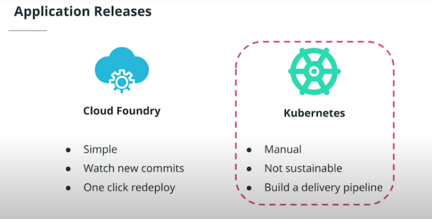

# CD

## Continuous Deployment

## Summary

- Throughout the Microservice Fundamentals course, we walked through a realistic example of how to choose an architecture for an application, package it using Docker, and deployed it to a Kubernetes cluster using a CI/CD pipeline.

  - We have started off with an overview of the cloud-native ecosystem and the tools it hosts. Then we've learned different application designs, such as monoliths and microservice, and implied trade-offs.
  - We then moved to package an application using Docker and deploy it to a Kubernetes cluster using imperative and declarative configurations.
  - Then, we transitioned into Platform as a Service (or PaaS) solutions and explored Cloud.

- Foundry as an approach to deploy an application without worrying about the underlying infrastructure.

  - And we finished this course, by practicing cloud-native tooling to construct a CI/CD pipeline.
  - We deep-dived into GitHub Actions and ArgoCD and explored template configuration managers, such as Helm.
  - Overall, in this course we have covered the following lessons:•Welcome•Architecture Considerations•Container Orchestration•Open Source PaaS Cloud Native CI/CD

- [ND064 C1 L4 13 Course Recap](https://www.youtube.com/watch?v=rb4BOakWoe4&feature=emb_imp_woyt)
- [ND064 C1 L4 14 Goodbye](https://www.youtube.com/watch?v=NabhBOKXn5Y&feature=emb_imp_woyt)

## Application Releases

- Automation of the release process is fundamental
- This module will focus on building a delivery pipeline to deploy to a Kubernetes cluster to completely automate the process using cloud native tooling

- Up to this stage, we have practiced the packaging of an application using Docker and its deployment to a Kubernetes cluster using kubectl commands.

  - As well, we have explored the simplified developer experience of application release with Cloud Foundry. However, in both cases, a user has to manually trigger and complete all the operations.
  - This is not sustainable if tens and hundreds of releases are performed within a day.
  - Automation of the release process is fundamental!In the case of a PaaS offering, the release of a new feature is managed by the provider.
  - For example, Cloud Foundry monitors the repository with the source code, and when a new commit is identified, the user can easily deploy the latest changes with a click of a button.
  - On the other side, releasing an application to a Kubernetes cluster consists of a series of manually typed docker and kubectl commands.
  - At this stage, this approach has no automation integrated.
  - In this lesson, we will not cover how a PaaS automates the release process, since this is already solutionized by the 3rd party providers. Instead, we will focus on building a delivery pipeline to automate the deployment to Kubernetes using cloud-native tooling.

- [ND064 L4 02 Big Picture](https://youtu.be/D0WMUP5qMYM)

---

## Continouos Application Deployment

[ND064 C1 L4 03 Continuous Application Deployment](https://www.youtube.com/watch?v=p_hVoLkTDp8)

- Every company has the same goal: to deliver value to customers and maintain customer satisfaction. To achieve this, an organization needs to be fast in integrating customer feedback and release new features.It is possible to manually deploy every release for a small product. However, this is not viable for a product that has thousands of microservices developed by hundreds of engineers. A delivery pipeline is essential for continuous and automated deployment of new functionalities.A delivery pipeline includes stages that can test, validate, package, and push new features to a production environment. It is common practice for the main branch commits to proceed through all stages of the pipeline to reach the end-users. Overall, a delivery pipeline is triggered when a new commit is available. The new changes should traverse the following stages:•Build - compile the application source code and its dependencies. If this stage fails the developer should address it immediately as there might be missing dependencies or errors in the code.•Test - run a suite of tests, such as unit testing, integration,
  UI, smoke, or security tests. These tests aim to validate the behavior of the code. If this stage fails, then developers must correct it to prevent dysfunctional code from reaching the end-users.•Package - create an executable that contains the latest code and its dependencies. This is a runnable instance of the application that can be deployed to end-users.•Deploy - push the packaged application to one or more environments, such as sandbox, staging, and production. Usually, the sandbox and staging deployments are automatic, and the production deployment requires engineering validation and triggering.It is common practice to push an application through multiple environments before it reaches the end-users. Usually, these are categorized as follows:•Sandbox - development environment, where new changes can be tested with minimal risk.•Staging - an environment identical to production, and where a release can be simulated without affecting the end-user experience.•Production - customer-facing environment and any changes in this environment will affect the customer experience.

- Overall, a delivery pipeline consists of two phases:•Continuous Integration (or CI) includes the build, test, and package stages.•Continuous Delivery (or CD) handles the deploy stage.Advantages of a CI/CD pipeline•Frequent releases - automation enables engineers to ship new code as soon as it's available and improves responsiveness to customer feedback.•Less risk - automation of releases eliminates the need for manual intervention and configuration.•Developer productivity - a structured release process allows every product to be released independently of other componentsNew Terms•Continuous Integration - a mechanism that produces the package of an application that can be deployed.•Continuous Delivery - a mechanism to push the packaged application through multiple environments, including production.•Continuous Deployment - a procedure that contains the Continuous Integration and Continuous Delivery of a product.Further ReadingExplore the CI/CD mechanism in more detail:•CI/CD: Continuous Integration & Delivery Explained•What’s the Difference Between Continuous Integration, Continuous Deployment and Continuous Delivery?

### Further Reading

- [CI/CD: Continuous Integration & Delivery Explained](https://semaphoreci.com/cicd)
- [What’s the Difference Between Continuous Integration, Continuous Deployment and Continuous Delivery?](https://semaphoreci.com/blog/2017/07/27/what-is-the-difference-between-continuous-integration-continuous-deployment-and-continuous-delivery.html)

---

Edge Case: Push and Pull methodologies for CI/CD

Summary
Within the CI/CD ecosystem, tools have a variate level of capabilities that offer the deployment of an application to production environments. At a high level, these tools are using a push-based or pull-based model to release new features.

Let's explore each CI/CD model in more detail!

Push-based CI/CD
In a push-based model, as shown in the image below, the developer commits new code to the Git repository (1), which triggers the Continuous Integration stages (2). The code is packaged and distributed using an image registry, such as DockerHub (3). The Continuous Delivery stage is triggered once the YAML manifests are updated to reference the new image tag (4). A Continuous Delivery tool then pushed the updated manifests to multiple clusters (5).

Flow diagram showcasing how the push-based CI/CD model works
Push-based CI/CD workflow

This model is fully operational and many tools within the ecosystem offer this deployment approach, e.g. Jenkins and CircleCI. However, there is one downside to this model: changes should be actively propagated to all environments. If this is not fulfilled, a scenario might be reached where multiple changes need to be deployed to production, which increases the failure rate and complicated the recovery procedures. Hence, wide awareness is required of features pushed to a production environment.

Pull-based CI/CD
In a pull-based CI/CD approach, the release process is still be triggered by a developer that pushed new features to the source code (1). The package (2) of the application is similar, resulting in a new image stored in DockerHub (3). However, once the YAML manifests are updated with the new image tag, a pull-based Continuous Delivery tool identifies new changes (4) and applies them to a Kubernetes cluster (5). As a result, this simplifies the process of application release, as new features can be applied automatically as soon as they are available. Tools that offer this CI/CD model are ArgoCD and Flux.

Flow diagram showcasing how the pull-based CI/CD model works
Pull-based CI/CD workflow

It is paramount to build a deployment pipeline that fits the business requirements closely and automates the release process. There is no "golden path" that would cover all engineering requirements. However, the pull and push-based CI/CD tools contribute to the ultimate goal to ships code securely, automatically, and reliably.

---

## Related Foam Links

- [[README]]
- [[argocd]]
- [[cd-fundamentals]]
- [[helm]]
- [[edge-case]]
