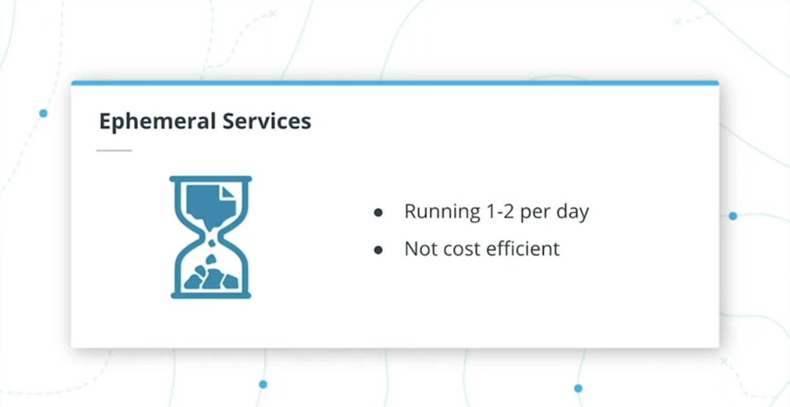
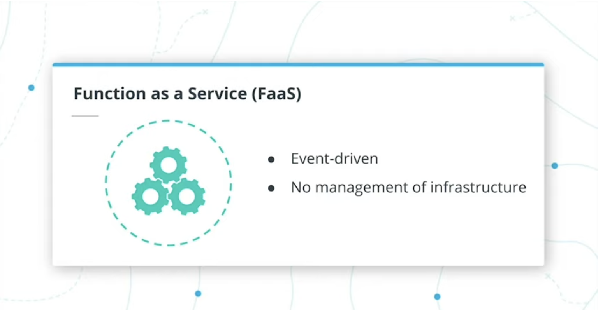
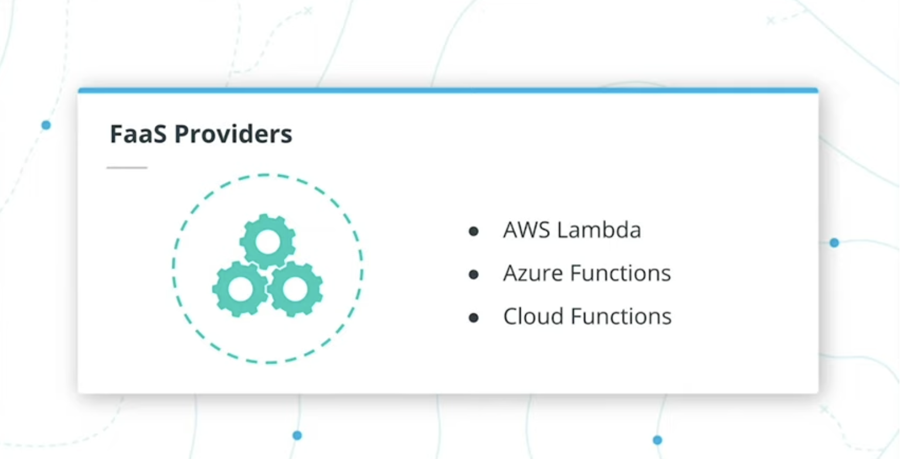
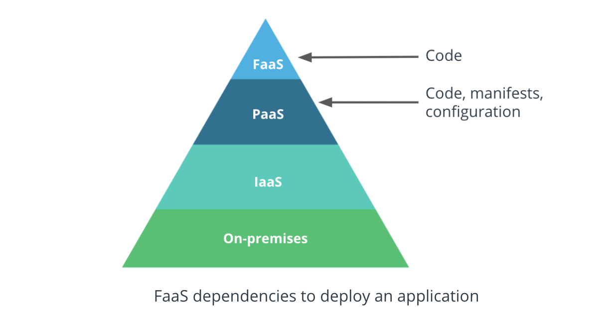

# FaaS

## Function as a Service

### **Summary 1**

- An organization will always explore the **most efficient offering to deploy a product to consumers**.
- **PaaS** solutions are lightweight on initial setup, as a team can release the code in production within days.

- However, there are use cases where customers interact with a service only once a day or for a couple of hours within a day.
  - **For example**, a service to update a timetable with the new bus schedule once a day. In this case, using a **PaaS** offering has one major downside:
    - it is not cost-efficient.
  - **For example**, with **Cloud Foundry** there will always be an instance of the application up and running, even if the service is used once a day. However, the team is billed for a full day.

- For this scenario, a **FaaS** or **Function as a Service** is a more suitable offering.
- **FaaS** is an event-driven cloud-computing service that allows the execution of code without any management of the infrastructure and configuration files.
- As a result, the timetable update service is invoked only once a day, and for the rest of the time, there are no replicas of this service.
- A team will be billed only for the time the service is executed.

- Popular FaaS solutions are:

  - [**AWS Lambda**]()
  - [**Azure Functions**]()
  - [**Cloud Functions from GCP**]()
  - and many more.

- Throughout the release process, a **FaaS** solution only requires the application code that is built and executed immediately.
- In comparison with a PaaS offering, this **FaaS** has a quicker usability rate, as no data management or configuration files are necessary.

- **Diagram of FaaS** offering dependencies to deploy an application
- **FaaS** dependencies to deploy an application

### **New Terms**

- **FaaS** or **Function as a Service** - event-driven cloud-computing service that requires only the application code to execute successfully.

## **Further Reading**

Explore FaaS in more detail:

- [What is Function-as-a-Service (FaaS)?](https://www.redhat.com/en/topics/cloud-native-apps/what-is-faas?source=searchresultlisting)

---

## **Exercise: Function as a Service**

- **FaaS (Function as a service)** unlocks the ability to solely focus on building an application with no concerns for the underlying infrastructure.

  - However, it is crucial to comprehend its usage within a microservice-based design.

- Imagine the following scenario:

  - you are working for a media (newspaper) company and was assigned to develop a microservice responsible for the life-cycle of customer accounts.
  - **The principal operations include account creation and deletion.**

- Considering the above, reflect on what mechanisms you would choose to deploy the **microservice**, **PaaS**, or **FaaS**. Elaborate on your reasoning.

## **What mechanism would you choose to deploy the customer account management microservice? Explain your reasoning.**

---

## **Solution: Function as a Service**

[Udacity, Video Link](https://www.youtube.com/watch?v=OCrjcLkDSX8)

- For this particular exercise, choosing either a **PaaS** or **FaaS** would reach the end goal: making the service available to customers.

- In most cases, in a newspaper context, the readers are more focused on the news content rather than managing their accounts.

  - Also, the number of requests to get an article can be a thousandfold higher than the number of requests to create or delete an account.
  - As such, you can assume that the microservice should not be running at all times consuming available resources, and instead invoke it on demand-only.

- Conclusively, a **FaaS** solution would be more suitable for the management of customer account microservice.

---

## **Lesson Conclusion**

### **Summary 2**

- Throughout its evolution, an organization needs to periodically evaluate available cloud-computing services, to ensure that the business requirements are always fulfilled.

  - The industry has an abundance of cloud-computing offerings, such as on-premise, **IaaS**, **PaaS**, and **FaaS**, with a rich collection of open-source and vendor managed tools.
  - In this lesson, we analyzed **Cloud Foundry**, an open-source **PaaS**, that can be hosted on any available compute and provide a unified and powerful end-user experience.
  - e have also explored, **FaaS** an event-driven offering, that increases the cost-efficiency of a platform.

- Overall, throughout this lesson we explored:
  - **PaaS Mechanisms**
  - **Cloud Foundry**
  - **Function as a Service**

## **Glossary**

- **On-premise** - cloud-computing service, where a team owns the entire technology stack.
- **IaaS** or **Infrastructure as a Service** - cloud-computing service that offers the abstraction of networking, storage, server, and virtualization layers.
- **PaaS** or **Platform as a Service** - cloud-computing service, where the infrastructure components are managed fully by a 3rd party provider, and a team manages only the application and the data associated with it.
- **Cloud Foundry** - an open-source PaaS offering, that can be hosted on any available infrastructure
- **FaaS** or **Function as a Service** - event-driven cloud-computing service that requires only the application code to execute successfully.

---

### Resources

- [Serverless (FaaS) vs. Containers - when to pick which?](https://www.serverless.com/blog/serverless-faas-vs-containers), **Serverless**
- [Serverless Vs Container (Lambda Vs Kubernetes)](https://www.youtube.com/watch?v=EpW28dvm_qo"), **YouTube**
- [Running serverless workload on Kubernetes](https://www.eventbrite.com/e/running-serverless-workload-on-kubernetes-with-knative-tickets-162340475733), **Eventbrite**, _Kubernetes Knative_
- [100 Seconds of ServerLess](https://youtu.be/W_VV2Fx32_Y), **YouTube**, _Fireship_
